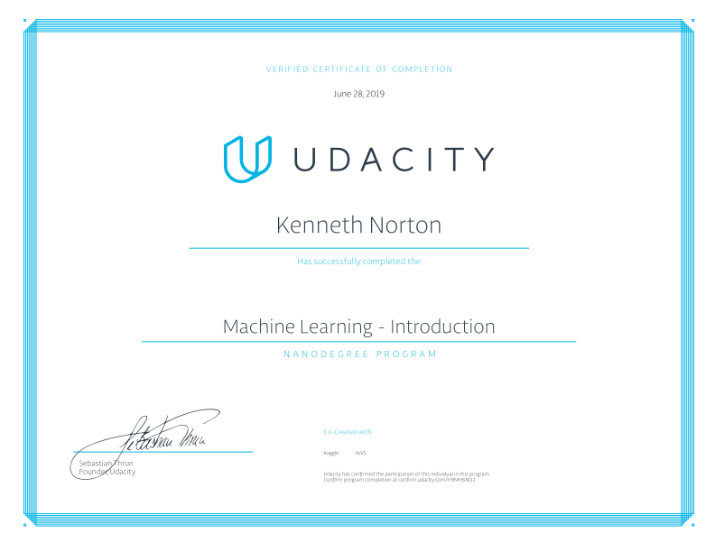

# Machine-Learning-Nanodegree

### Copyright © 2019, Ken Norton

This repository contains projects for Udacity's [Intro to Machine Learning Nanodegree](https://d20vrrgs8k4bvw.cloudfront.net/documents/en-US/intro-to-machine-learning-nanodegree-program-syllabus.pdf). The nanodegree was completed on June 27, 2019.

---

## [Project 1: Supervised Learning – Finding Donors for CharityML](p1_finding_donors)

In this project, you will employ several supervised algorithms of your choice to accurately model individuals' income using data collected from the 1994 U.S. Census. You will then choose the best candidate algorithm from preliminary results and further optimize this algorithm to best model the data.

## [Project 2: Deep Learning - Image Classifier](p2_image_classifier)

In this project, you'll train an image classifier to recognize different species of flowers. You can imagine using something like this in a phone app that tells you the name of the flower your camera is looking at. In practice you'd train this classifier, then export it for use in your application.

## [Project 3: Unsupervised Learning - Identify Customer Segments](p3_customer_segments)

In this project, you will apply unsupervised learning techniques to identify segments of the population that form the core customer base for a mail-order sales company in Germany. These segments can then be used to direct marketing campaigns towards audiences that will have the highest expected rate of returns.

